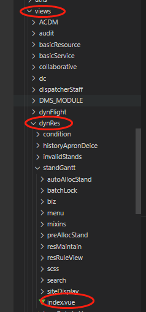
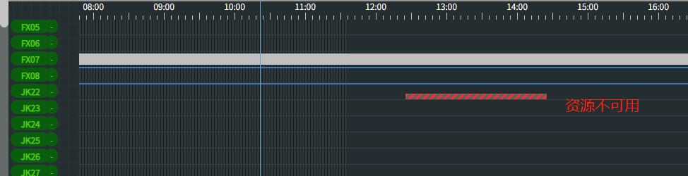
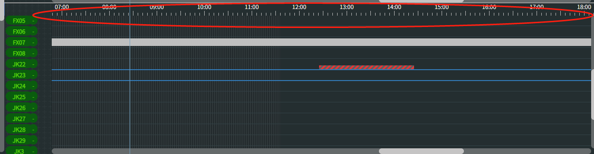
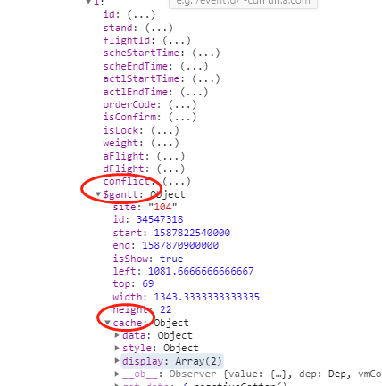

# 甘特图组件使用教程
> 包含机位甘特图、查询甘特图组件参数传递、API调用、组件关键源码解析etc.

## 机位甘特图使用说明
### 1.目录结构
  * `src\views\dynRes\standGantt\index.vue` 是机位甘特图的路由入口,在这里进行甘特图数据的初始化、让甘特图组件显示，为甘特图组件添加参数，事件等，业务逻辑处理也在这里，甘特图组件只负责甘特图的显示，处理拖拽逻辑等，业务相关的逻辑由调用方处理
  * 导入甘特图组件
  
  ```js
  import Gantt from '@/components/gantt/index'
  ```
### 2.数据初始化
  ```js
  async mounted() {
    this.isInitOk=false
    if(process.env.NODE_ENV=='development'){
      // this.now = this.getNow(new Date('2020-02-20 07:12'))
      this.now = this.getNow(new Date())
    }else{
      this.now = this.getNow(new Date())
    }
    await this.initBaseData()
    await this.initData()
    this.initUpKeepData()
    this.initDataEmpowerment()
    setTimeout(()=>{
      this.$nextTick(()=>{
        this.isInitOk=true
        this.$refs.gantt.moveViewPort()
      })
    },10)
  }
  ```
  机位甘特图界面组件在`mounted`方法内，进行相关数据初始化,`this.now`设置当前时间，`initBaseData`初始化基础数据
  ```js
  async initBaseData(){
      await this.getState() //初始化航班状态基础数据
      await this.initColorConfig()//初始化甘特图颜色配置基础数据
      await this.initBarDisplay()//初始化甘特条显示内容配置
      await this.initStandDisplay()//初始化机位显示配置
    }
  ```
  根据业务场景的不同可初始化对应的基础数据。
  `initUpKeepData`,`initDataEmpowerment`为资源不可用，数据赋能在甘特图界面上的体现，界面展现如下：
  
  > 资源不可用核心原理是甘特图界面加载完毕后，再次请求不可用数据，进行不可用数据与机位（甘特图里面的一行）的匹配，在gantt-row组件里面动态绘制一个div
  ```js
  <!-- 资源不可用占用显示 -->
  <template v-for="(val,key) in maintainMap">
      <div
        @contextmenu="contextmenuClick2($event,item,key)"
        class="maintain-res"
        :class="[key]"
        v-for="item in val"
        :title="maintainNames[key]+':'+item.description"
        :style="[{'width':item.width+'px',left:item.left+'px'},item.$style]"
        :key="item.id">
      </div>
  </template>
  ```

### 3. 参数传递
  >为甘特图组件传递参数及监听事件
  ```js
  <Gantt
      ref="gantt"
      :start="start"
      :end="end"
      :now="now"
      :changeHeight="true"
      :rowKey="rowKey"
      :isShowTopScale="true"
      :getGanttProps="mountInfo4Flight"
      :cacheStyleFunc="getComputedContent"
      :rows="sites"
      @onDrag="onDragBar"
      one-to-many-key="flightId"
      @bar-context-menu="onBarRightClick"
      @maintain-ctx-menu="onMaintainClick"
    >
    <!-- 待分区左侧区域显示（不显示机位） -->
    <template slot="row-header-none" slot-scope="{row:s}">
    </template>
    <!-- 待分区左侧区域显示(显示机位） -->
    <template slot="row-header-alloc" slot-scope="{row:s}">
    </template>
    <!-- 甘特条实现 -->
    <template slot="gantt" slot-scope="{data:gantBar,data:{$gantt}}">
    </template>
  </Gantt>
  ```
  `甘特图`组件传参说明:
  > start,end,now 就可以确定甘特图显示的时间范围，航班数据中的`startTime`,`endTime`用于定位航班的x轴定位，`stand`用于定位数据所在的行（甘特图y轴是机位列表，1行是一个机位，一般显示code编码）

    * `start`:timestamp 甘特图开始时间
    * `end`:timestamp   甘特图结束时间
    * `now`:timestamp   甘特图当前时间
  
    * `changeHeight` 是否允许拖拽刻度尺来改变布局高度
    * `:rowKey` 甘特图中行的唯一标识 默认`code` 与机位基础数据的`code`字段对应
    * `isShowTopScale` 是否显示顶部待分区的刻度尺
    * `getGanttProps`  甘特图组件获取必要参数的方法，需用户手动传入,示例代码如下:
    ```js
    function mountInfo4Flight(v,isWaitSection){
      let info={};
      v.$gantt=info;
        //挂载机位
        if(isWaitSection){

        }else{
          if (v.stand&&v.stand.code) {
            info[this.rowKey] = v.stand.code
          } else {
            info[this.rowKey] = v.stand || null;
          }
        }

        info['id'] = v.flightid || v.flightId;//flightid

        let start = v.actlStartTime || v.scheStartTime
        let end = v.actlEndTime || v.scheEndTime;

        let startTime = 0
        let endTime = 0
        /*进机位时间*/
        startTime = this.$moment(start,this.DATE_FMT).valueOf();
        endTime = this.$moment(end,this.DATE_FMT).valueOf();

        info.start = startTime
        info.end = endTime
        return v
    }
    ```
    > 上述代码为航班数据，挂载了start,end,stand等，`为必须传递的参数`,用于组件内部使用,

    * cacheStyleFunc 数据计算缓存方式，用于在`slot="gantt"`的slot中直接引用变量或者属性，这样界面组件更新时，直接取值而非实时计算，优化性能
    * rows 类型Array 甘特图行数据
    * @onDrag(barId,targetRowCode,dragRowType) 甘特条拖拽事件，支持已分区->已分区 待分区->已分区
        `1.barId 甘特条id,getGanttProps传入的id($gantt->id0`
        `2.targetRowCode 目标行的code编号即行数据的code字段`
        `3.dragRowType 来源区域的类型 0 待分区 1已分区`
    *  one-to-many-key="flightId" 当存在多个甘特条对应一个数据实体时，用于标识定位相关数据，如机位甘特图
      进行机位分割，多个id的甘特条数据对应一个航班ID
     在进行数据更新或者操作时，不能仅依靠data.id来处理，可能造成数据遗漏，或者错误,此时通过flightId，找到所有相关的数据进行处理
    *  @bar-context-menu="onBarRightClick" 甘特条右键菜单事件 `e:原生事件`,`ganttBar:甘特条数据`,`pos:top,bottom 点击的区域`
    *  @maintain-ctx-menu="onMaintainClick" 资源不可用甘特图右键菜单事件 `e:原生事件`,`item:不可用数据`,`type:stand,gate,bridge 不可用资源类型`

### 4. slot使用说明
 `代码`:
 ```html
 <!-- 甘特条内容slot -->
        <template slot="gantt" slot-scope="{data:gantBar,data:{$gantt}}">
          <div
            :key="gantBar.id"
            v-if="gantBar"
            v-show="$gantt.isShow"
            class="gantt-bar"
            :data-id1="gantBar.id"
            :data-id2="$gantt.id"
            :class="[{state:'state'+gantBar.state,'lock':gantBar.isLock=='Y'},...$gantt.cache.style.class]"
            :style="{left: $gantt.left+'px', width: $gantt.width+'px'}"
          >
                  <template v-if="gantBar.aFlight&&gantBar.dFlight">
                    <div
                      class="left-triangle"
                      :class="[{'upwheel':$gantt.cache.data.upwheel,'carousel':$gantt.cache.data.carousel}]">
                      <i class="fa fa-caret-left" :style="getStateColor($gantt,'in',false)"></i>
                    </div>
                    <div class="bg-main">
                      <div
                        :style="getStateColor($gantt,'in')"
                      ></div>
                      <div
                        :style="getStateColor($gantt,'out')"
                      ></div>
                      <span class="bar-content left"  :style="getTxtColor($gantt)">{{$gantt.cache.display[0].prefix}}</span>
                      <span class="bar-content middle" :style="getTxtColor($gantt)">{{$gantt.cache.display[0].middle}}</span>
                      <span class="bar-content right" :style="getTxtColor($gantt)">{{$gantt.cache.display[0].suffix}}</span>
                    </div>
                    <div class="right-triangle" :class="{'downwheel':$gantt.cache.data.downwheel,gate:$gantt.cache.data.gate}">
                      <i class="fa fa-caret-left" :style="getStateColor($gantt,'out',false)"></i>
                    </div>
                </template>

                <template v-else-if="gantBar.aFlight&&!gantBar.dFlight">
                  <div class="left-triangle" :class="{'upwheel':$gantt.cache.data.upwheel,'carousel':$gantt.cache.data.carousel}">
                    <i class="fa fa-caret-left" :style="getStateColor($gantt,'in',false)"></i>
                  </div>
                  <div class="bg-main" :style="getStateColor($gantt,'in')" >
                    <span class="bar-content left" :style="getTxtColor($gantt)">{{$gantt.cache.display[0].prefix}}</span>
                    <span class="bar-content middle" :style="getTxtColor($gantt)">{{$gantt.cache.display[0].middle}}</span>
                    <span class="bar-content right" :style="getTxtColor($gantt)">{{$gantt.cache.display[0].suffix}}</span>
                  </div>
                </template>

                <template v-else-if="!gantBar.aFlight&&gantBar.dFlight">
                  <div class="bg-main" :style="getStateColor($gantt,'out')">
                    <span class="bar-content left" :style="getTxtColor($gantt)">{{$gantt.cache.display[1].prefix}}</span>
                    <span class="bar-content middle" :style="getTxtColor($gantt)">{{$gantt.cache.display[1].middle}}</span>
                    <span class="bar-content right" :style="getTxtColor($gantt)">{{$gantt.cache.display[1].suffix}}</span>
                  </div>
                  <div class="right-triangle" :class="{'downwheel':$gantt.cache.data.downwheel,gate:$gantt.cache.data.gate}">
                    <i class="fa fa-caret-left" :style="getStateColor($gantt,'out',false)"></i>
                  </div>
                </template>
                <!-- cobt延迟提前 -->
                <template v-if="$gantt.cache.data.cobt">
                  <template v-if="$gantt.cache.data.cobt.type==='inner'">
                    <div class="cobt-empowerment inner" :style="{'left':$gantt.cache.data.cobt.left+'px'}" :title="'COBT提前:'+$gantt.cache.data.cobt.time">
                      <div class="bg"></div>
                    </div>
                  </template>
                    <template v-else>
                      <div class="cobt-empowerment outer" :title="'COBT延后:'+$gantt.cache.data.cobt.time" :style="{'left':$gantt.cache.data.cobt.left+'px',width:$gantt.cache.data.cobt.width+'px'}">
                        <div class="bg"></div>
                      </div>
                    </template>
                </template>
          </div>
        </template>
 ```
 `说明`
  *  slot="gantt"即为甘特图组件的甘特条实现slot,由使用方传入相关实现，一般通过div+css即可实现常见需求
  *  `slot-scope="{data:gantBar,data:{$gantt}}"`通过作用域插槽，为slot传入相关使用数据,`data`即为航班数据,`$gantt`为挂在data上的附加信息，通过`data.$gantt`使用,
  
  ---
  可以直接使用data，在slot中渲染数据，比如:
```html
      <!--  gantBar即为data，也就是接口返回的一条航班数据 -->
      <div
            :key="gantBar.id"
            v-if="gantBar"
            v-show="$gantt.isShow"
            class="gantt-bar"
            :data-id1="gantBar.id"
            :data-id2="$gantt.id"
            :class="[{state:'state'+gantBar.state,'lock':gantBar.isLock=='Y'},...$gantt.cache.style.class]"
            :style="{left: $gantt.left+'px', width: $gantt.width+'px'}"
          ></div>
```
  * 建议使用data.$gantt来渲染数据,因为相关计算已经提前缓存，直接使用即可，降低slot中逻辑代码，更简洁
  * `getGanttProps`参数会为每一条数据挂载$gantt字段，里面保存了相关数据，一方面供组件内部使用，一方面可对外使用，如slot;$gantt中的site,id,start,end,left,top,width,height等数据，会在调用init或者update方法时，进行构造或者更新
  * `cacheStyleFunc` 返回的对象数据会挂载到$gantt.cache上，示例代码如下
```js
/**
     * 甘特图内容计算方法，用于模板初始化时，计算缓存数据，用于界面展示，这样可以不必实时计算甘特条的显示内容
     */
    getComputedContent(data,getLeftPx){
      let empowerment = data.$gantt.empowerment||{}
      let upwheel=null
      let carousel=null
      let downwheel=null
      let gate=null
      let cobt=null

      //甘特条进出属性，单段或拼接
      let ganttAttr=null;
      if(data.aFlight&&data.dFlight){
        ganttAttr ='AD'
      }else{
        ganttAttr = data.aFlight?'A':'D'
      }

      if(['AD','D'].includes(ganttAttr)){
        upwheel = empowerment['D']&&empowerment['D'].aibt
      }

      if(['AD','A'].includes(ganttAttr)){
        carousel = empowerment['A']&&empowerment['A'].carouselConfirmed
      }

      if(['AD','D'].includes(ganttAttr)){
        downwheel = empowerment['D']&&empowerment['D'].aobt
      }

      if(['AD','D'].includes(ganttAttr)){
        gate = empowerment['D']&&empowerment['D'].gateConfirmed
      }

      if(['AD','D'].includes(ganttAttr)){
        let cobtTime = empowerment['D']&&empowerment['D'].cobt
        if(cobtTime){
          cobtTime = this.$moment(cobtTime,'YYYYMMDDHHmm').valueOf()
          let start = data.$gantt.start
          let end = data.$gantt.end
          let barWidth = data.$gantt.width
          if(cobtTime>start){
            let type ='inner';//inner,outer
            let left =0;
            let width=0;
            if(cobtTime<end){
              type='inner'
              left = getLeftPx(start,cobtTime)
            }else{
              type='outer'
              left=barWidth
              width=getLeftPx(end,cobtTime)
            }
            cobt={
              type,
              left,
              width,
              time:this.$moment(cobtTime).format('YYYY-MM-DD HH:mm')
            }
          }
        }
      }

      let empowermentDisplay={
          upwheel,
          carousel,
          downwheel,
          gate,
          cobt,
      }
      let cfgData =
        {
          width:data.$gantt.width,
          minWidth:this.minGanttBarWidth,
          config:this.barDisplay
        }
      return {
        data:{
          ...empowermentDisplay
        },
        style:getFlightStyle(data,this.flightStateMap,this.configColors),//配色相关
        display:getGanttBarDisplayContent(data,cfgData),
      }
    }
```
最终`return`的```{data,style,display}```与`slot="gantt"`对应，这样数据获取、缓存、模版中使用均进行解耦，甘特图组件不关心细节的数据结构，方便移植或其他地方使用
## 查询甘特图使用说明
  > 查询甘特图的使用与机位甘特图使用基本一致，只不过屏蔽了拖拽事件处理,右键菜单只保留`航班详情`,`流程图`等查询菜单，总结一句话：目前查询甘特图也是将机位甘特图文件夹整体拷贝，然后屏蔽相关操作的功能，包括过滤面板及甘特图操作，只保留查询功能及数据更新功能（websocket）
